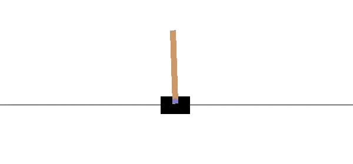
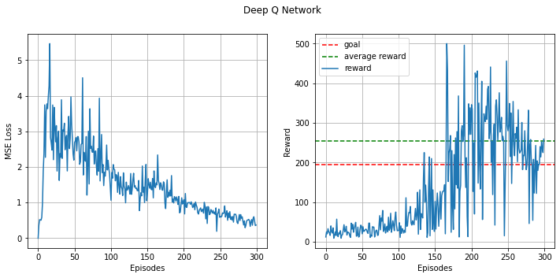

# Deep Q-Network with Experience Replay



Deep Q-Network implementation using Keras to solve the CartPole problem in OpenAI's gym. The goal is to teach an agent to balance an inverted pendulum perfectly using reinforcement learning.

This was implemented using a feed forward neural network as a non-linear value function approximator.

## [CartPole](https://gym.openai.com/envs/CartPole-v0/) Problem Statement:
A pole is attached by an un-actuated joint to a cart, which moves along a frictionless track. The system is controlled by applying a force of +1 or -1 to the cart. The pendulum starts upright, and the goal is to prevent it from falling over. A reward of +1 is provided for every timestep that the pole remains upright. The episode ends when the pole is more than 15 degrees from vertical, or the cart moves more than 2.4 units from the center.

## Results:

* CartPole-v0 defines "solving" as getting average reward of 195.0 over 100 consecutive trials.
* The DQN is very susceptible to initial weights, usually crosses the goal after 50-60 episodes but it may be unreliable.
* Some initialisations ensured a constant episode length of 500 after 50 episodes.

## Usage:
1. Run ```pip install -r requirements.txt```.
2. Tune hyperparameters in ```DQN-Code.ipynb```, run the model.
3. Run the last cell in ```DQN-Code.ipynb``` to save the model files.
4. Run ```render.py``` to visualise the solution.
